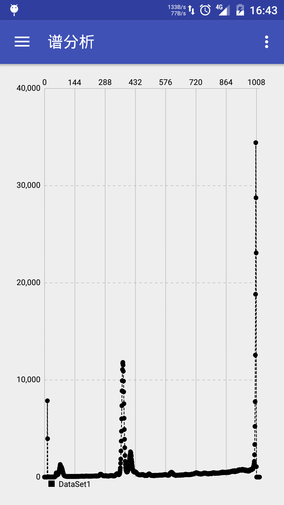
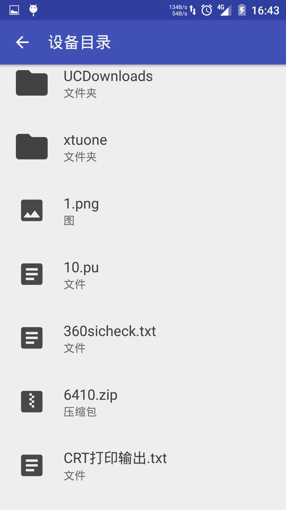
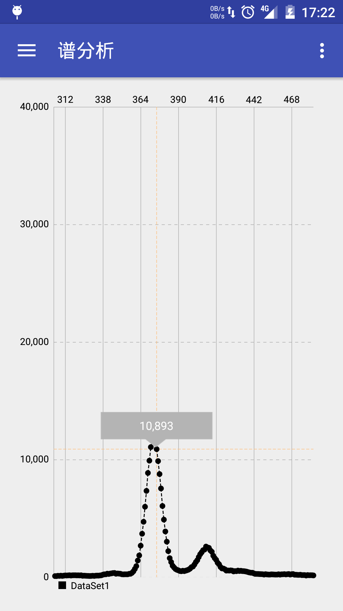
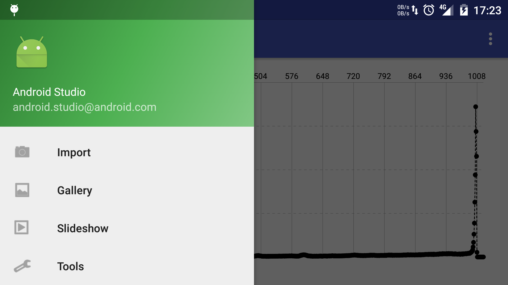
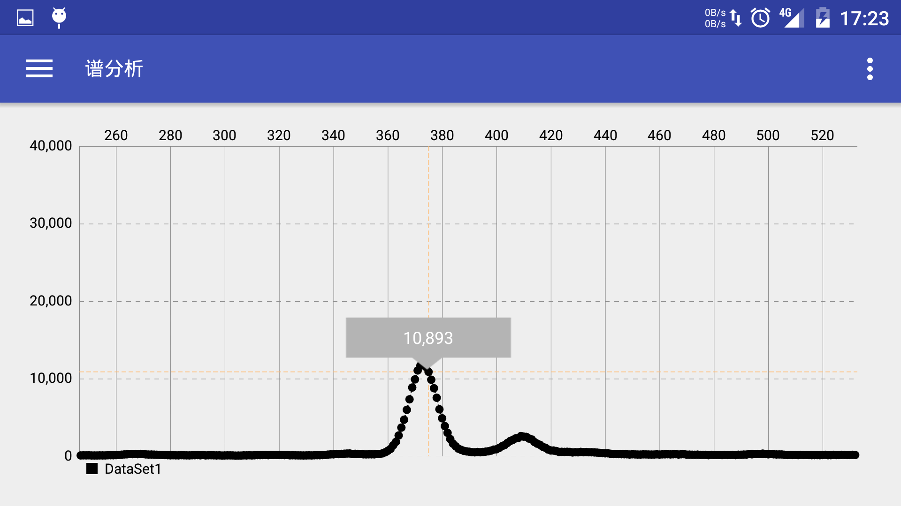

Android版谱分析软件
===================

基本要求
--------
- 1.  读谱数据文件、保存光滑后的谱数据文件，文件名可选；

- 2.  显示谱数据， 各算法要以函数方式实现；

- 3.  显示分析谱段范围内， 寻得的各峰位道址、能量、对应的元素名称；

- 4.  光滑、寻峰宽度 2k+1 应在 5、 7 之间可选，讨论最佳参数。

测试数据： Gss5-6.mca 数据文件， energy.cal 能量刻度系数文件， element.lib 元素库文件。

析谱段范围： ① 351—520 道， ② 581—750 道。

以实现功能
---------

- 1.  读谱数据文件、保存光滑后的谱数据文件，文件名可选；

只能选取已.mca二进制文件和.pu文本文件的读入数据

- 2.  显示谱数据， 各算法要以函数方式实现；

显示数据以实现各个算法都MATLAB实现够，目前没有移植到Java中

- 3.  此Android按照Google推荐的Material Design设计原则实现

以实现功能截图
  

 
